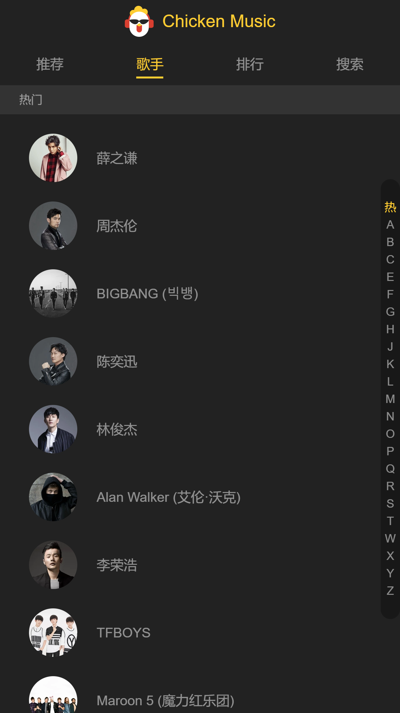

# 音乐播放器

## 项目描述

+ 一款UI完善，基于vuejs实现的音乐播放器（用于学习练手，项目还未完成）
+ 数据通过QQ音乐获取

## 项目的建立

四个页面分类(推荐、歌手、排行、搜索)
首页 : 1.轮播图 2.热门歌单推荐
歌手页 : 1.歌手列表 2.歌手详情 3.歌曲列表 4.核心功能播放器
排行页 : (待完成)
搜索 : (待完成)

## 项目效果

+ 
+ 
+ 
+ 

## 如何查看项目

1. 将代码`clone`到本地
2. `npm i`下载依赖
3. `npm run dev`运行
**由于首页轮播图QQ音乐数据请求发生变化，导致轮播图无法显示**